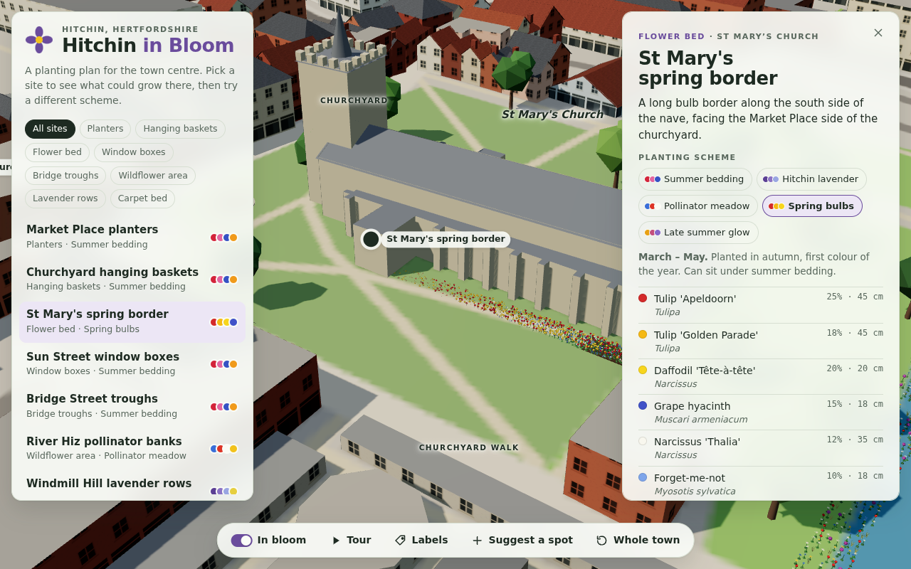

# Hitchin in Bloom

An interactive 3D model of Hitchin town centre showing where flower beds,
planters, window boxes and hanging baskets could go. It's for presenting ideas
to the council, businesses, sponsors and residents.



## What it does

- **3D model of real Hitchin**: about 8,300 buildings from real footprints,
  every street, footpath and railway line, the River Hiz and its bridges, parks,
  playing fields and allotments, all laid over real terrain (Windmill Hill rises
  about 28 m above Market Place). The area covered is about 2.6 × 2.3 km around
  the town centre. Orbit, pan and zoom with the mouse or touch.
- **15 proposed planting sites**, from the Market Place planters to lavender
  rows on Windmill Hill and planters on Station Approach. Each has a description, why it was chosen, care and
  watering needs, planted area and a rough plant count.
- **Five planting schemes** (summer bedding, Hitchin lavender, pollinator
  meadow, spring bulbs, late summer glow). Switch the scheme on any site and
  the flowers regrow in the new colours.
- **In bloom toggle**: compare the town as it is with the town in flower.
- **Tour**: flies between the sites automatically. Good for a presentation
  screen.
- **Suggest a spot**: click anywhere on the map to propose a new site. Ideas
  are saved in the browser and can be copied as text to pass on.
- Dark mode shows the town at dusk with lit windows.
- A link like `…/#windmill-hill` opens straight onto a site.

## Running it

```bash
npm install
npm run dev          # local dev server at http://localhost:5173
npm run build        # static site in dist/ (host anywhere)
npm run build:single # one self-contained HTML file in dist-single/
```

To publish on GitHub Pages, go to **Settings → Pages → Source** and choose
**GitHub Actions**. `.github/workflows/deploy.yml` then builds and deploys
every push to `main`.

## Editing the sites and schemes

All content lives in two data files, so no 3D knowledge is needed:

- `src/data/sites.js`: the planting schemes (plants, colours, heights, mix),
  the sites (name, text, location and shape of each bed or container) and the
  landmark labels.
- `src/data/hitchin.json`: the map data, generated by the script below.

Coordinates are in metres, with the origin in the middle of Market Place.
`x` runs east and `z` runs **south** (north is negative `z`).

## Where the map comes from

`scripts/fetch_hitchin.py` downloads the town centre from open data and writes
`src/data/hitchin.json`:

- **Buildings, streets, paths, railways, water, parks and land use**:
  [Overture Maps](https://overturemaps.org), which is built largely on
  OpenStreetMap. Map data © OpenStreetMap contributors, available under the
  [ODbL](https://www.openstreetmap.org/copyright).
- **Terrain**: [AWS Terrain Tiles](https://registry.opendata.aws/terrain-tiles/).

Building outlines are real. Heights are real where they're mapped, and
otherwise estimated from the building type (houses get pitched roofs; shops
and larger buildings are 2–3 storeys). Window details and wall colours are
illustrative. The planting sites are proposals only.

To refresh the data (for example after new buildings are mapped):

```bash
pip install pyarrow fsspec aiohttp requests shapely pillow
python scripts/fetch_hitchin.py
```

Improving OpenStreetMap for Hitchin (building heights, trees) improves this
model the next time the script is run.

## Tech

[Three.js](https://threejs.org/) + [Vite](https://vitejs.dev/). The flowers are
GPU-instanced (about 35,000 plants), with a small shader for the growing and
swaying animation. There's no backend.
