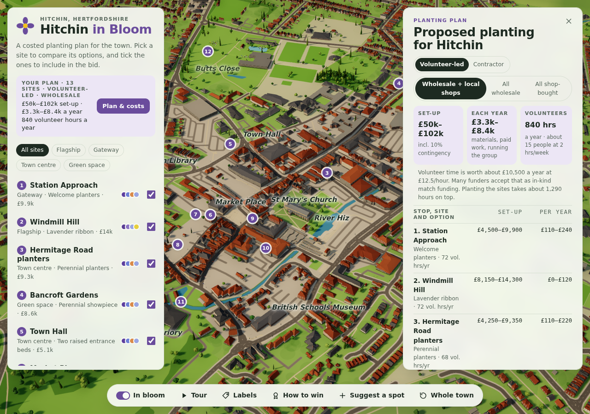

# Hitchin in Bloom

An interactive 3D model of Hitchin town centre showing where flower beds,
planters, window boxes and hanging baskets could go. It's for presenting ideas
to the council, businesses, sponsors and residents.



## What it does

- **3D model of real Hitchin** in an architectural-model style. It shows about
  8,300 buildings on their real footprints, with proper hipped roofs, Georgian,
  Tudor and Victorian fronts in the old town, and shopfronts on the high streets.
  It also has every street and footpath, the railway, the River Hiz and its
  bridges, parks and real terrain. Windmill Hill rises about 28 m above Market
  Place. There are lamp posts, benches, people for scale, soft ambient shading
  and a tilt-shift "miniature" effect up close.
- **A costed planting plan for the council.** It covers 13 sites in four groups
  (flagship, gateway, town centre, green space). Most have 2–3 options, and the
  recommended one is listed first. Each option shows:
  - set-up and yearly running costs as ranges, with a line-by-line breakdown
  - upkeep, impact and wildlife ratings
  - the planting palette, and the planted area and container counts measured
    from the model
  - why the site was chosen, who owns the land, what needs checking before going
    ahead, and possible partners
- **Volunteer-led or contractor costing.** In volunteer-led mode, volunteers
  do the planting, watering and weeding, so only materials are costed. Work
  that has to be paid (traffic management, work at height on lamp columns,
  structural fixings, machinery) stays paid. The plan shows the volunteer hours
  needed, roughly how many regular volunteers that means, and the value of that
  time as in-kind match funding. It also adds the programme's own costs: tools,
  a watering bowser, insurance, training and the entry fee.
- **Plan & costs** totals the chosen options, adds a 10% contingency, and
  copies a ready-to-paste summary for a council paper. Tick sites in or out of
  the plan and the totals update.
- **How to win** explains the Anglia in Bloom / RHS Britain in Bloom marking:
  horticulture 40, environment 30 and community 30 marks, with Gold at 85 or
  more. It shows which sites in the plan score strongly on each, gives a
  checklist of what judges look for beyond the planting, and suggests a judges'
  route. The numbered pins and the Tour follow that route.
- **In bloom toggle**: compare the town as it is today with the town in flower.
- **Suggest a spot**: residents click on the map to propose a new site.
- Dark mode shows the town at dusk with lit windows and street lamps.
- A link like `…/#windmill-hill` opens straight onto a site.

## About the costs

Costs are **budget ranges**, not quotes. Plant material is priced per plant
(or per m² of seed) from UK supplier prices seen online, for example
wildflower seed at £28–43/kg sown at 4 g/m², lavender plugs and 9 cm liners by
the hundred, and bulbs by the thousand. The sources are listed under "Where the
prices come from" in the app. A switch chooses how plants are bought:

- **Wholesale + local shops** (default): 80% trade plugs, bulbs and seed, 20% bought locally
- **All wholesale**
- **All shop-bought**

Rates live in `PRICES` and `RATES` in `src/data/sites.js`. Change them once
you have quotes and every figure in the app updates.

## Running it

```bash
npm install
npm run dev          # local dev server at http://localhost:5173
npm run build        # static site in dist/ (host anywhere)
npm run build:single # one self-contained HTML file in dist-single/
```

To publish on GitHub Pages, go to **Settings → Pages → Source** and choose
**GitHub Actions**. `.github/workflows/deploy.yml` then builds and deploys
every push to `main`.

## Editing the sites and schemes

All content lives in two data files, so no 3D knowledge is needed:

- `src/data/sites.js`: the cost rates, planting palettes (plants, colours,
  heights, mix), the sites and their options (text, costs, location and shape
  of each bed or container) and the landmark labels.
- `src/data/hitchin.json`: the map data, generated by the script below.

Coordinates are in metres, with the origin in the middle of Market Place.
`x` runs east and `z` runs **south** (north is negative `z`).

## Where the map comes from

`scripts/fetch_hitchin.py` downloads the town centre from open data and writes
`src/data/hitchin.json`:

- **Buildings, streets, paths, railways, water, parks and land use**:
  [Overture Maps](https://overturemaps.org), which is built largely on
  OpenStreetMap. Map data © OpenStreetMap contributors, available under the
  [ODbL](https://www.openstreetmap.org/copyright).
- **Terrain**: [AWS Terrain Tiles](https://registry.opendata.aws/terrain-tiles/).

Building outlines are real. Heights are real where they're mapped, and
otherwise estimated from the building type (houses get pitched roofs; shops
and larger buildings are 2–3 storeys). Window details and wall colours are
illustrative. The planting sites are proposals only.

To refresh the data (for example after new buildings are mapped):

```bash
pip install pyarrow fsspec aiohttp requests shapely pillow
python scripts/fetch_hitchin.py
node scripts/roofs.mjs   # adds hipped roofs (straight skeletons) to every footprint
```

Improving OpenStreetMap for Hitchin (building heights, trees) improves this
model the next time the script is run.

## Tech

[Three.js](https://threejs.org/) + [Vite](https://vitejs.dev/). The flowers,
trees and street furniture are GPU-instanced. Ambient occlusion comes from
[N8AO](https://github.com/N8python/n8ao), and roofs from
[straight-skeleton](https://github.com/StrandedKitty/straight-skeleton). There's
no backend.
